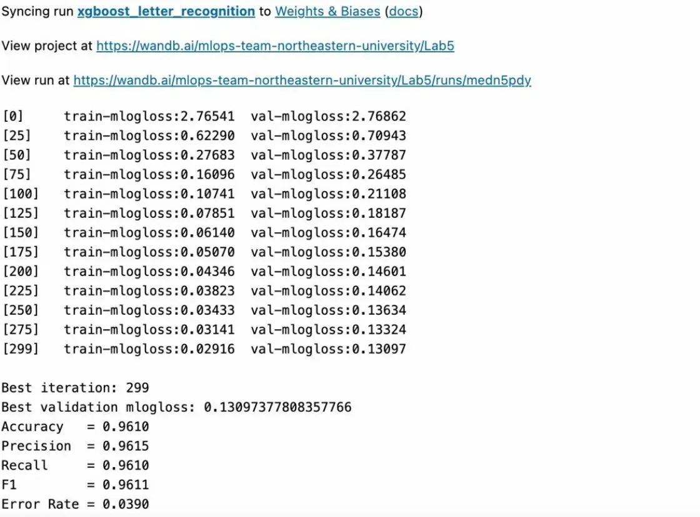
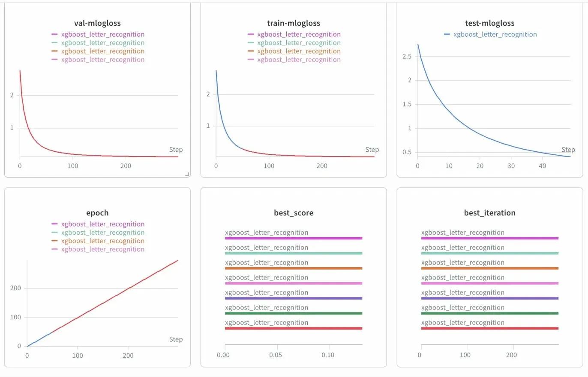
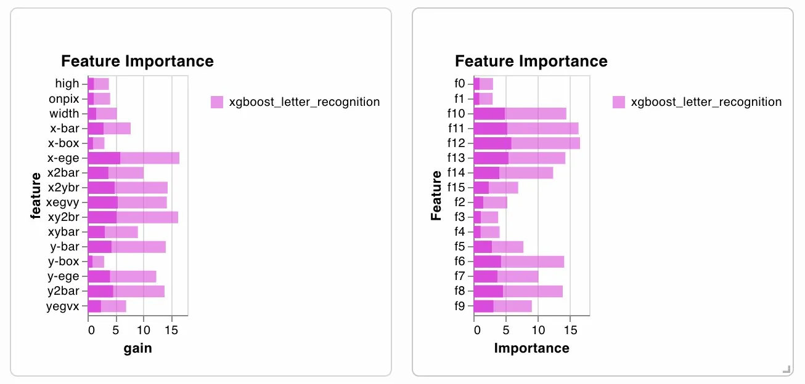
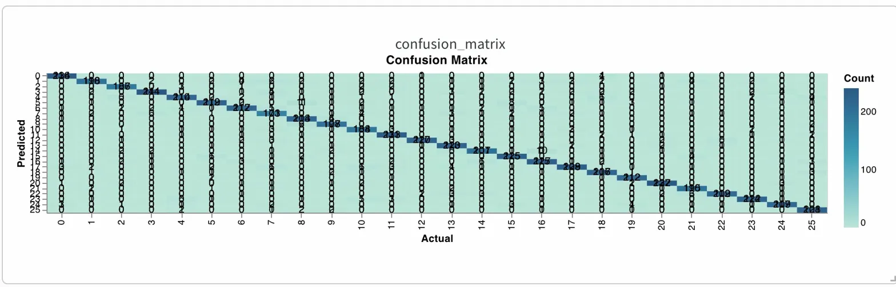
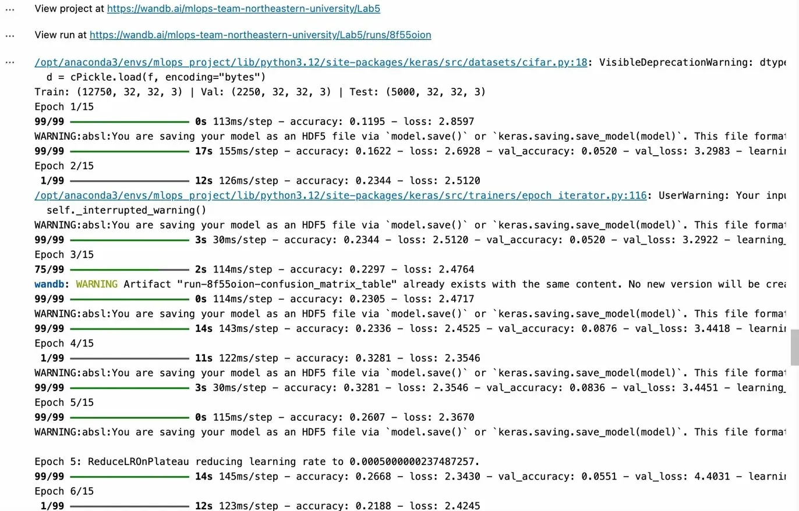
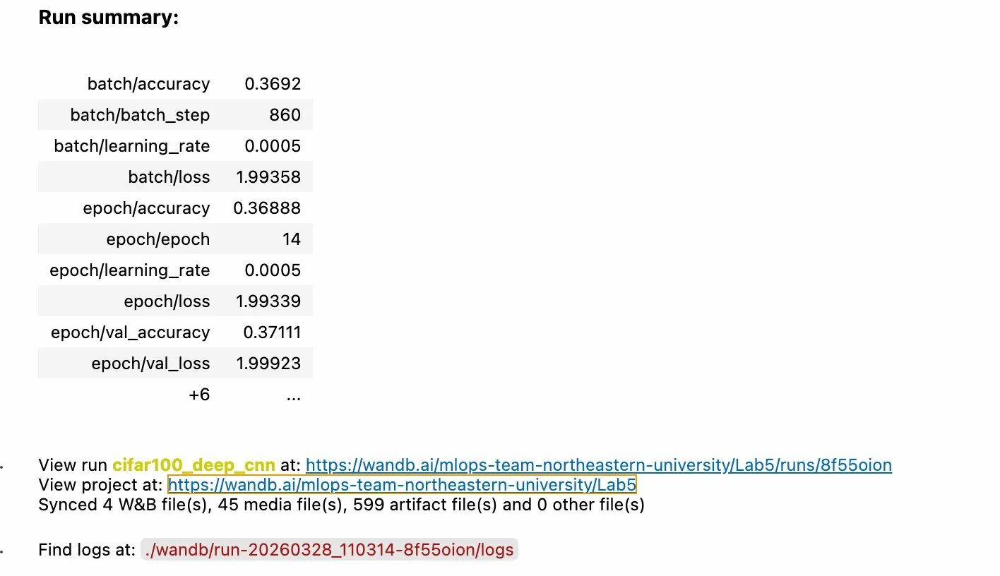
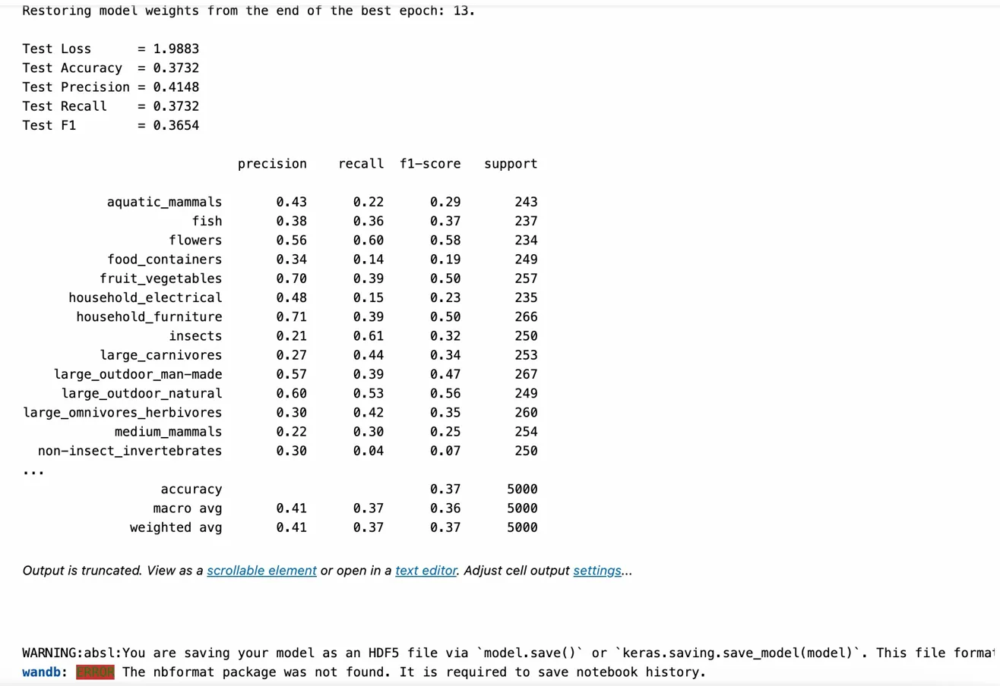

# Lab_05 — Experiment Tracking with Weights & Biases

Two machine learning experiments tracked end-to-end with **Weights & Biases (W&B)**:

- **Lab1** — XGBoost classifier on UCI Letter Recognition (26 classes, A–Z)
- **Lab2** — Deep CNN on CIFAR-100 coarse labels (20 superclasses)

Both are modified from the original course repo with different datasets, models, hyperparameters, and dashboard visualizations.

---

## Overview

**Lab1** downloads the Letter Recognition dataset (20,000 samples, 16 features),
splits it into train / val / test, trains an XGBoost model with early stopping,
and logs metrics, confusion matrix, feature importance, and the trained model to W&B.

**Lab2** loads CIFAR-100 coarse labels (32×32 RGB images, 20 superclasses),
trains a 3-block CNN with BatchNorm, data augmentation, and early stopping,
and logs loss curves, sample predictions, confusion matrix, per-class accuracy, and the trained model to W&B.

---

## Project Structure

```
Lab_05/
├── Lab1.ipynb                  # xgboost on letter recognition
├── Lab2.ipynb                  # cnn on cifar-100
├── README.md
├── SETUP.md                    # step-by-step run instructions
├── screenshots/
│   ├── lab1_run_summary.png
│   ├── lab1_loss_curves.png
│   ├── lab1_feature_importance.png
│   ├── lab1_confusion_matrix.png
│   ├── lab2_training_output.png
│   ├── lab2_run_summary.png
│   └── lab2_classification_report.png
├── artifacts/                  # created at runtime
│   ├── xgb_letter_model.json
│   ├── cifar100_model.h5
│   └── model_summary.txt
└── wandb/                      # created at runtime
```

---

## Lab 1 — Results

| Metric | Value |
| --- | --- |
| Accuracy | 96.1% |
| Precision | 96.2% |
| Recall | 96.1% |
| F1 | 96.1% |
| Error Rate | 3.9% |
| Best Iteration | 299 / 300 |

### What's different from the original

| What | Original | Modified |
| --- | --- | --- |
| Dataset | Dermatology (366 samples, 6 classes) | Letter Recognition (20,000 samples, 26 classes) |
| Objective | `multi:softmax` | `multi:softprob` |
| Hyperparameters | eta=0.1, max_depth=6, 5 rounds | eta=0.08, max_depth=8, up to 300 rounds |
| Regularization | None | L1 + L2 + subsampling |
| Split | Sequential 70/30 | Stratified 70/15/15 train/val/test |
| Early stopping | None | 20 rounds patience on val set |
| Metrics | Error rate only | Accuracy, Precision, Recall, F1, classification report |
| Dashboard | Confusion matrix only | Confusion matrix + feature importance chart |
| Artifact | None | Model saved to W&B |

### Screenshots

#### Run Summary


#### Loss Curves


#### Feature Importance


#### Confusion Matrix


---

## Lab 2 — Results

| Metric | Value |
| --- | --- |
| Accuracy | 37.3% |
| Precision | 41.5% |
| Recall | 37.3% |
| F1 | 36.5% |
| Best Epoch | 13 / 15 |

Training is stable with no overfitting (train ≈ val loss).
37% is expected for a baseline CNN on CIFAR-100 with limited data (15k samples).
Random guessing on 20 classes would be 5%, so the model is 7× better than chance.

**Best classes:** flowers (0.58 F1), fruit_vegetables (0.50 F1), large_outdoor_natural (0.56 F1)

**Hardest classes:** non-insect_invertebrates (0.07 F1), food_containers (0.19 F1)

### What's different from the original

| What | Original | Modified |
| --- | --- | --- |
| Dataset | Fashion MNIST (28×28 grayscale, 10 classes) | CIFAR-100 coarse (32×32 RGB, 20 classes) |
| Architecture | 1 Conv2D → MaxPool → Flatten → Dense | 3 conv blocks (Conv2D + BatchNorm) → GlobalAvgPool → Dense(256) |
| Optimizer | SGD (lr=0.01) | Adam (lr=0.001) + ReduceLROnPlateau |
| Early stopping | None, fixed 5 epochs | Patience 5, restore best weights |
| Augmentation | None | Rotation, shifts, horizontal flip |
| Split | Test set reused as validation | Proper train/val/test split |
| Metrics | Loss + accuracy only | Accuracy, Precision, Recall, F1, classification report |
| Dashboard | Sample table + confusion matrix | + per-class accuracy + LR curve |
| Artifact | Basic model save | Model + summary saved to W&B |

### Screenshots

#### Training Output


#### Run Summary


#### Classification Report


---

## W&B Project Links

- **Project:** [Lab5](https://wandb.ai/mlops-team-northeastern-university/Lab5)
- **Lab1 Run:** [xgboost_letter_recognition](https://wandb.ai/mlops-team-northeastern-university/Lab5/runs/medn5pdy)
- **Lab2 Run:** [cifar100_deep_cnn](https://wandb.ai/mlops-team-northeastern-university/Lab5/runs/6y8qr4ru)
